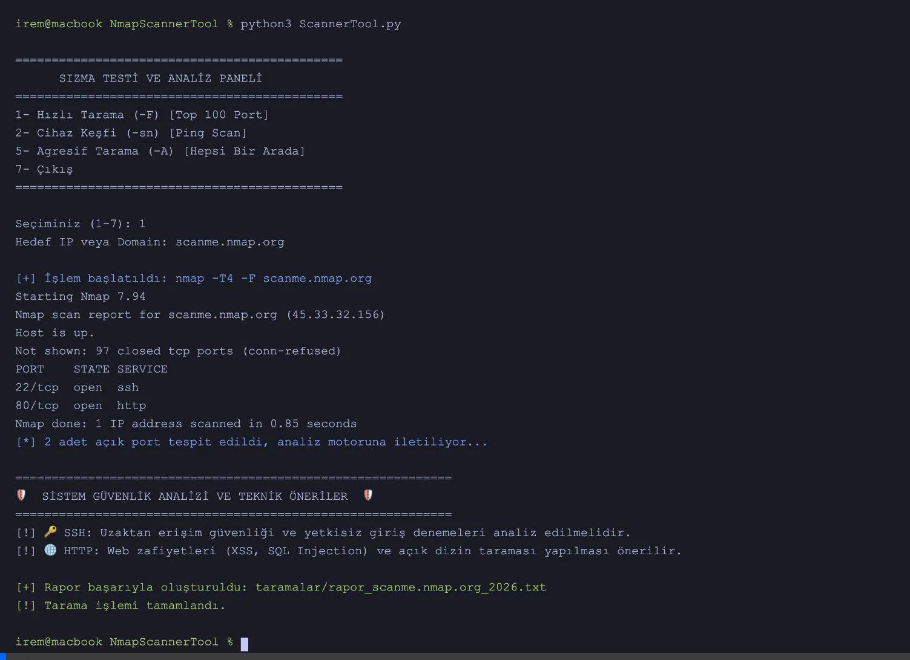

# 🛡️ NmapScannerTool: Gelişmiş Ağ Analiz ve Güvenlik Çözümü

   

**Üniversite Adı:** İstinye Üniversitesi  
**Danışman/Eğitmen:** Keyvan Arasteh Abbasabad  
**Geliştirici:** İrem Yasav

NmapScannerTool; ağ keşfi, servis analizi ve zafiyet tespiti süreçlerini modüler bir yapıda otomatize eden Python tabanlı bir güvenlik aracıdır. Proje, sadece tarama yapmakla kalmaz; tespit edilen bulguları anlamlandırarak teknik raporlar üretir.

---

## 📑 İçindekiler
- [Demo](#-demo)
- [Özellikler](#-özellikler)
- [Proje Mimarisi](#-proje-mimarisi-modüler-yapı)
- [Kurulum](#️-kurulum)
- [Kullanım](#-kullanım)
- [Docker ile Kullanım](#-docker-ile-kullanım)
- [Katkıda Bulunma](#-katkıda-bulunma)
- [Lisans](#-lisans)

---

## 🎬 Demo
Aşağıdaki animasyonda `main.py` üzerinden kurulum, yardım menüsü, hızlı tarama, cihaz keşfi ve mimari analizi (wc -l) barındıran kapsamlı (*comprehensive*) demo senaryosunu izleyebilirsiniz:



---

## 🚀 Özellikler

* 🔍 **Standart Tarama:** Hedef IP üzerindeki temel portları ve servis durumlarını tespit eder.
* ⚙️ **Versiyon Tespiti (-sV):** Çalışan servislerin detaylı sürüm bilgilerini görüntüler.
* 💻 **OS Analizi (-O):** Hedef cihazın işletim sistemi tahminlerini analiz eder ve listeler.
* ⚡ **Hızlı Tarama (-F):** En yaygın 100 portu hızlıca tarayarak zaman tasarrufu sağlar.
* 📡 **Ping Scan (-sn):** Cihazların ağ üzerindeki aktiflik durumunu kontrol eder.
* 🧠 **Akıllı Analiz Motoru:** Açık portlar için otomatik güvenlik sıkılaştırma önerileri üretir.
* 📂 **Otomatik Raporlama:** Tüm tarama sonuçlarını tarih damgalı `.txt` dosyaları olarak arşivleme (`taramalar/` klasöründe).
* 🛡️ **Zafiyet Tarama:** Nmap Script Engine (NSE) entegrasyonu ile zafiyet keşfi.
* ⚙️ **Merkezi Yapılandırma:** Tarama hızını ve parametrelerini tek bir dosyadan yönetme kolaylığı.

---

## 📂 Proje Mimarisi (Modüler Yapı)

Proje, sürdürülebilir kod prensiplerine uygun olarak aşağıdaki bileşenlere ayrılmıştır:

| Dosya Adı | Görev |
| :--- | :--- |
| **`main.py`**          | CLI arayüzü ve merkezi uygulama girişi. |
| **`ScannerTool.py`**   | Nmap süreç yönetimi ve tarama fonksiyonları. |
| **`AnalizMotoru.py`**  | Port bazlı teknik risk analizi ve çözüm önerileri. |
| **`Ayarlar.py`**       | Tarama hızı ve dizin ayarlarının yönetimi. |
| **`RaporOlusturucu.py`**| Tarama sonuçlarının `.txt` formatında raporlanması. |
| **`ZafiyetTarayici.py`**| Hassas dizin ve zafiyet tarama modülü. |
| **`requirements.txt`** | Python paket bağımlılıkları. |
| **`Dockerfile`**       | Uygulamanın konteyner mimarisi yapılandırması. |

---

## 🛠️ Kurulum

### Gereksinimler
Sisteminizde **Nmap**'in kurulu olması gerekmektedir:
- **Debian / Ubuntu:** `sudo apt install nmap`
- **MacOS:** `brew install nmap`
- **Windows:** [Nmap resmi sitesinden](https://nmap.org/download.html#windows) indirerek kurulumu tamamlayabilirsiniz.

### Adımlar

1. Gerekli Python kütüphanelerini yükleyin (`colorama` vb.):
   ```bash
   pip3 install -r requirements.txt
   ```

---

## 💻 Kullanım

Uygulamayı başlatmak için ana modülü (`main.py`) çalıştırın:

```bash
python3 main.py
```

Uygulama size interaktif bir menü sunacaktır. İlgili adımları takip ederek taramalarınızı başlatabilirsiniz. Çıktılar otomatik olarak `taramalar/` klasöründe arşivlenir.

---

## 🐳 Docker ile Kullanım

Uygulamayı lokal sisteminize hiçbir şey kurmadan Docker üzerinden tam izole bir ortamda da çalıştırabilirsiniz:

1. İmajı oluşturun:
   ```bash
   docker build -t nmap-scanner-tool .
   ```

2. Konteyneri başlatın:
   ```bash
   docker run -it --rm nmap-scanner-tool
   ```

---

## 🤝 Katkıda Bulunma

1. Bu depoyu fork'layın.
2. Yeni bir özellik dalı oluşturun (`git checkout -b feature/YeniOzellik`).
3. Değişikliklerinizi commit'leyin (`git commit -am 'Yeni özellik eklendi'`).
4. Dalınıza push yapın (`git push origin feature/YeniOzellik`).
5. Bir Pull Request açarak projeye katkıda bulunun.

---

## 📜 Lisans

Bu proje **MIT Lisansı** ile lisanslanmıştır. Detaylar için `LICENSE` dosyasına göz atabilirsiniz.
